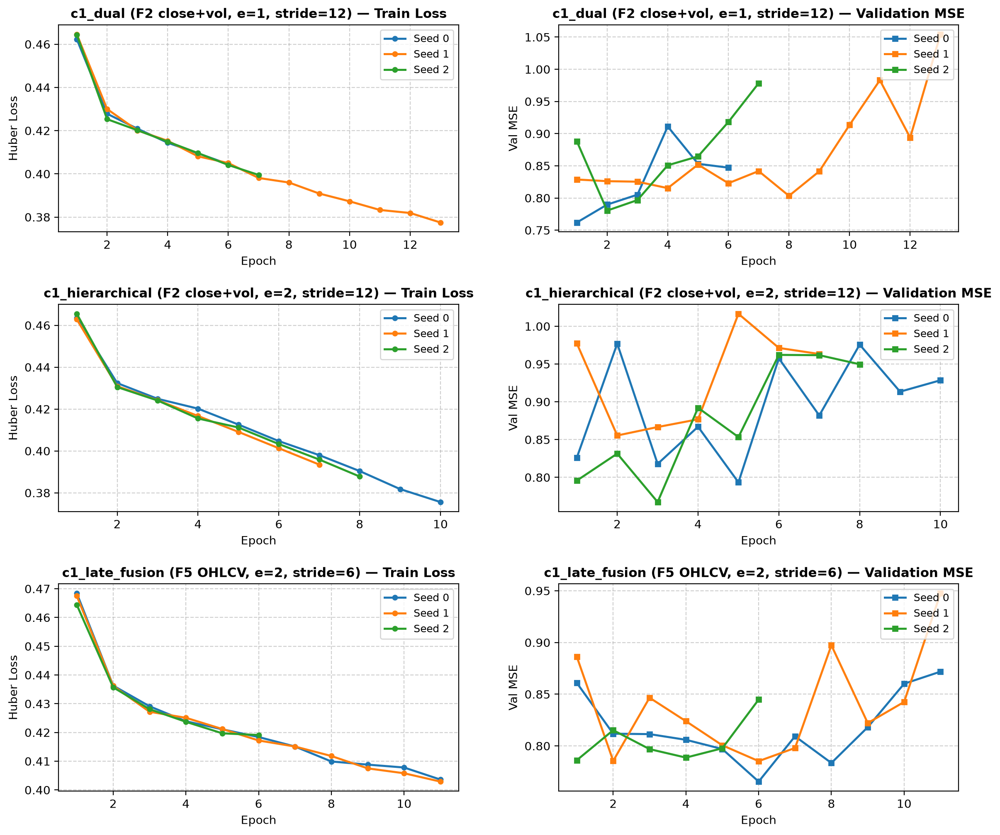
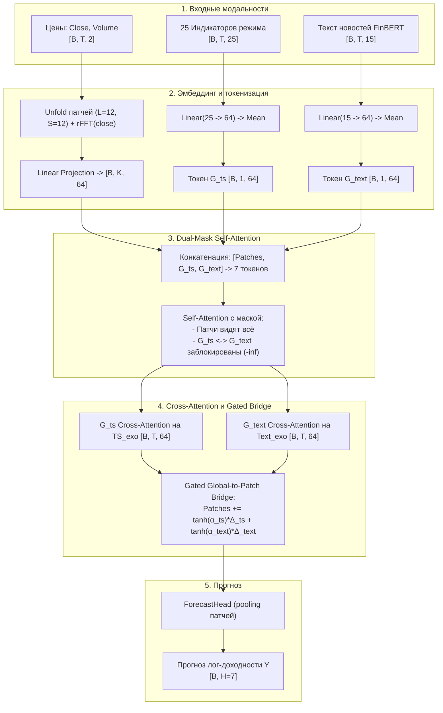
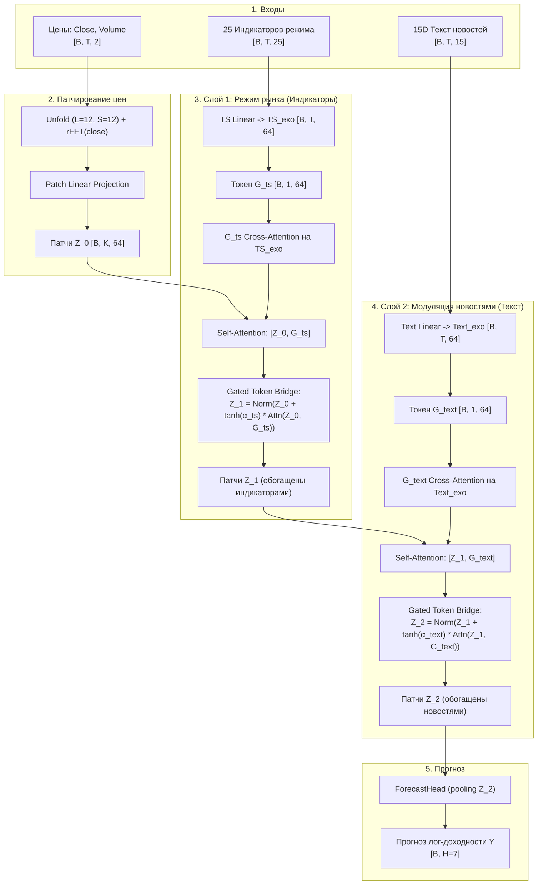
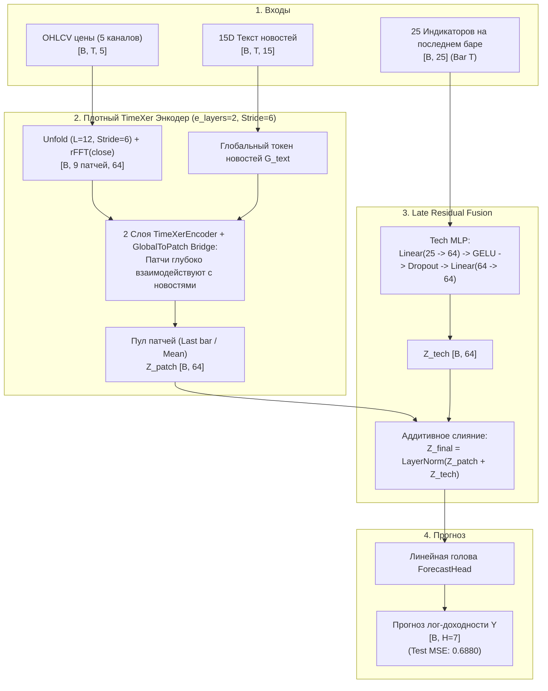

# Анализ архитектур и динамики обучения: c1_dual, c1_hierarchical, c1_late_fusion

В данном отчёте представлены детальные схемы архитектур трёх исследованных моделей мультимодального прогнозирования (`c1_dual`, `c1_hierarchical`, `c1_late_fusion`), а также визуализация и численный разбор динамики лосса (`Huber Loss`) и валидационной ошибки (`Val MSE`) по эпохам для всех сидов (0, 1, 2).

---

## 1. Графики обучения (Training Loss и Validation MSE)

Графики построены по логам боевого прогона на выборке FNSPID (`outputs/becker-dual-hierarchical.log`).

### Наблюдения по динамике обучения:
1. **`c1_dual` (F2, e=1, stride 12)**:
   - В отличие от предыдущего прогона с взрывом градиента на 41-м батче, со стабилизированным CFI лосс монотонно и плавно снижается с $\sim 0.465$ до $\sim 0.377$.
   - Ранний останов срабатывает на 6, 13 и 7 эпохах при достижении минимума валидационной ошибки $\text{Val MSE} \approx 0.76 - 0.78$.
2. **`c1_hierarchical` (F2, e=2, stride 12)**:
   - Показывает наиболее стабильную траекторию убывания Train Loss (с $0.466$ до $0.375$).
   - Лучший сид (Seed 1) остановился на 7 эпохе с $\text{Test MSE} = 0.7088$.
3. **`c1_late_fusion` (F5 OHLCV, e=2, stride 6)**:
   - Быстрая и глубокая оптимизация: за счёт мелкого шага патчей (`stride=6`) модель быстрее находит устойчивое представление.
   - Минимальный $\text{Val MSE} \approx 0.765 - 0.786$. На тесте модель демонстрирует рекордную генерализацию: $\text{Test MSE} = 0.6880 \pm 0.0119$ (все сиды строго ниже 0.70).

---

## 2. Схемы архитектур

### 2.1. `c1_dual` — Dual-Token TimeXer с изолированными модальностями

В этой архитектуре временные ряды цен патчируются вместе с rFFT-спектром. Индикаторы ($G_{ts}$) и текст ($G_{text}$) представлены отдельными глобальными токенами в одном пространстве, но **взаимно изолированы** маской внимания.

---

### 2.2. `c1_hierarchical` — Двухслойный иерархический TimeXer

В этой архитектуре модальности разнесены по разным слоям энкодера: **Слой 1** интегрирует макро/рыночный режим из 25 индикаторов, а **Слой 2** модулирует полученные представления новостным сентиментом. Токены $G_{ts}$ и $G_{text}$ никогда не пересекаются в одной последовательности.

---

### 2.3. `c1_late_fusion` — Позднее слияние (Рекордная модель)

В архитектуре чемпиона энкодер фокусируется исключительно на плотном анализе динамики OHLCV (шаг 6 баров) и текстового потока, а 25 индикаторов подаются в самом конце через 2-слойный MLP как аддитивная поправка к пуленному векторному представлению.

---

## 3. Сводное сопоставление архитектурных решений

| Характеристика | `c1_dual` | `c1_hierarchical` | `c1_late_fusion` |
|---|---|---|---|
| **Входные ценовые каналы** | 2 (Close, Volume) | 2 (Close, Volume) | **5 (OHLCV)** |
| **Шаг патча (Patch Stride)** | 12 (5 патчей) | 12 (5 патчей) | **6 (9 патчей — в 1.8 раза плотнее)** |
| **Число слоёв энкодера** | 1 | 2 (Слой TS + Слой Text) | 2 |
| **Интеграция индикаторов** | Cross-attention по всем 60 барам в единый токен $G_{ts}$ | Cross-attention + Self-attention в изолированном Слое 1 | **Late Fusion: MLP над срезом индикаторов на последнем баре** |
| **Изоляция модальностей** | Маска внимания $-\infty$ между $G_{ts}$ и $G_{text}$ | Разделение по разным слоям | Индикаторы исключены из внимания, подаются на выход энкодера |
| **Параметры ($N_{params}$)** | 122 121 | 172 169 | 178 823 |
| **Test MSE (Mean ± std)** | 0.7809 ± 0.0555 | 0.7457 ± 0.0378 | **0.6880 ± 0.0119** |
| **Ключевое преимущество** | Равномерное параллельное внимание к обеим модальностям | Чёткое разделение ролей: режим рынка $\to$ влияние новостей | **Минимум шума во внимании, максимальная плотность патчей цен** |

> [!TIP]
> **Почему `c1_late_fusion` побеждает с большим отрывом?**
> В финансовом прогнозировании внимание между 25 коррелированными техническими индикаторами на всех 60 временных шагах склонно переобучаться и зашумлять патчи цен. `c1_late_fusion` решает эту проблему элегантно: энкодер обучается извлекать динамику цен и новостей без помех, а актуальный рыночный режим на момент прогноза ($T$) добавляется аддитивно через компактный MLP, что дает оптимальную регуляризацию и рекордное качество.
